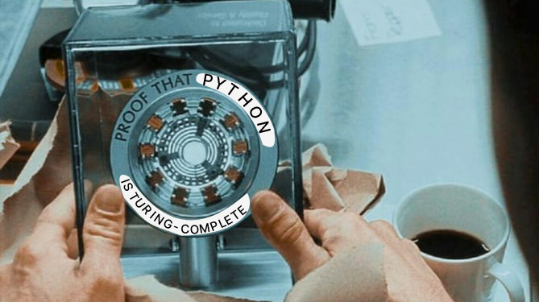

# Turing Machine

<p align='center'>
    
</p>

A very simple, pure-Python implementation of a [Turing Machine](https://en.wikipedia.org/wiki/Turing_machine), created for educational purposes and to show that Python is [Turing-complete](https://en.wikipedia.org/wiki/Turing_completeness). The implementation is designed to be as straightforward as possible, with the core component consisting of just about 60 lines of code (20 of which being comments 🤓).

## What is a Turing Machine?

A Turing Machine is an idealized computational device first described by Alan Turing in 1936 which, despite its simplicity, can simulate any algorithm and therefore compute any algorithmically specifiable series of numbers. By serving as a model of what is theoretically computable, the Turing Machine underpins the functioning and design of modern digital computers.

## How does a Turing Machine work?

A Turing Machine constists of four components:

- An arbitrarily long tape devided into cells. Each cell contains a symbol taken from a finitely-long list of symbols
- A pointer which identifies the currently selected cell (and therefore the currently selected symbol)
- A <i>machine state</i> selected from a finitely-long list of possible machine states
- An <i>instructions table</i> which, given a current symbol - current state pair, instructs the machine to do the following:
    - substitute the currently selected symbol with a different symbol 
    - move the tape either left or right
    - modify the current machine state.

<p align='center'>
    
</p>

Given an <i>initial state</i>, an <i>initial tape configuration</i> and an <i>instructions table</i>, the Turing Machine performs the following steps until it reaches a <i>halting</i> state:

1. Read the currently selected symbol
2. From the instruction table, get the instruction associated with the current symbol-state pair
3. Substitute the current symbol with the one specified in the instruction
4. Move the tape in the direction specified in the instruction
5. Substitute the current machine state with the one specified in the instruction

## How to use it

The Turing Machine defined in this work makes use of three symbols: `0`, `1` and `" "` (meaning <i>blank</i>). It can therefore perform arbitrary computation on binary-encoded numbers.

In order to run your computation, instantiate a `TuringMachine` by passing it four parameters:

1. `instructions_table`: a `list` of `list`'s, containing one list per instruction; each instruction should be a `list` containing exactly 5 elements, in the following order:
    - `current_state`: the machine state that needs to be present for this instruction to be executed, must be either `int` or `str`
    - `current_symbol`: the symbol that needs to be selected for this instruction to be executed, must be one of `0`, `1` and `" "`
    - `write_instruction`: the new symbol that should replace `current_symbol`, must be one of `0`, `1` and `" "`
    - `move_instruction`: the direction in which the tape should be moved; should be `"L"` for 'left' and `"R"` from 'right' (or `" "` for neither, exclusively used in conjunction with `new_state = "stop"`)
    - `new_state`, the new state that should replace `current_state`, must be either `int` or `str`; in order to signal to the machine that it should stop the execution, `new_state` must be equal to `"stop"`
2. `initial_tape`: a `list` defining the initial tape; must only contain one of the three allows symbols, i.e. `0`, `1` or `" "`.
3. `initial_state`: the initial machine state, must be either `int` or `str`
4. `initial_cursor`: the initial position of the cursor with respect to `initial_tape`; must be an `int` such that `o <= initial_cursor <= len(initial_tape)`.

## Examples

### Example 1: single-state machine

Following the example [described at this link](https://www.cl.cam.ac.uk/projects/raspberrypi/tutorials/turing-machine/one.html#one-three), let us implement a simple, single-state bit-inverter machine. The bit-inverter will do the following:
- takes in a list of bits `[1, 1, 0]` 
- starting from the last bit `0`, and moving backwards, inverts each bit
- returns the inverse list `[0, 0, 1]`. 

This can be done by passing the following `instructions_table`

```Python

instructions_table = [ 
    [ 0, ' ', ' ', ' ', 'stop' ],
    [ 0, 0, 1, 'R', 0 ],
    [ 0, 1, 0, 'R', 0 ]
]
```

Which resolves to the following instructions:

| current_state | current_symbol | write_instruction | move_instruction | new_state |
| ------------- | -------------- | ----------------- | ---------------- | --------- |
| 0             | " "            | " "               | " "              | "stop"          |
| 0             | 0              | 1                 | right            | 0         |
| 0             | 1              | 0                 | right            | 0         |

Let us then define the initial tape `[1, 1, 0]`, the initial state `0` and the initial cursor position `2` (meaning on the last bit `0`).

```Python
tape = [ 1, 1, 0 ]
state = 0
cursor = 2
```

Let us then instantiate the `TuringMachine` by passing it the parameters above and call it

```Python
t = TuringMachine(instructions_table, tape, state, cursor)
final_tape = t()

# >>> outputs [0, 0, 1]
```

This will output `[0, 0, 1]`, which is the correctly inverted list of bits.

### Example 2: finite-state

Following the example [desribed here](https://www.cl.cam.ac.uk/projects/raspberrypi/tutorials/turing-machine/one.html#one-six), let us implement a bit more convoluted, two-states bit-array inverter. The bit-inverter will do the following:
- takes in a list of bits preceded by a blank symbol: `[" ", 0, 0, 1]` 
- starting from the blank symbol and moving forward, inverts each bit
- returns the inverse list `[1, 1, 0]` (in which the initial blank symbol has been ignored). 

This can be done by passing a slightly more complicated `instructions_table`

```Python

instructions_table_2 = [ 
    [ 0, ' ', ' ', 'L', 1 ],
    [ 0, 0, 1, 'R', 1 ],
    [ 0, 1, 0, 'R', 0 ],
    [ 1, ' ', ' ', 'R', 'stop' ],
    [ 1, 0, 1, 'L', 1 ],
    [ 1, 1, 0, 'L', 1 ]
]
```

Which resolves to the following instructions:

| current_state | current_symbol | write_instruction | move_instruction | new_state |
| ------------- | -------------- | ----------------- | ---------------- | --------- |
| 0             | " "            | " "               | left             | 1         |
| 0             | 0              | 1                 | right            | 1         |
| 0             | 1              | 0                 | right            | 0         |
| 1             | " "            | " "               | right            | "stop"    |
| 1             | 0              | 1                 | left             | 1         |
| 1             | 1              | 0                 | left             | 1         |

Let us then define the initial tape `[" ", 0, 0, 1]`, as well as the initial state `0` and the initial cursor position `0` (meaning on the blank character `" "`).

```Python
tape = [ " ", 0, 0, 1 ]
state = 0
cursor = 0
```

Let us then instantiate the `TuringMachine` by passing it the parameters above and call it

```Python
t = TuringMachine(instructions_table, tape, state, cursor)
final_tape = t()

# >>> outputs [1, 1, 0]
```

This will output `[1, 1, 0]`, which is the correctly inverted list of bits.
